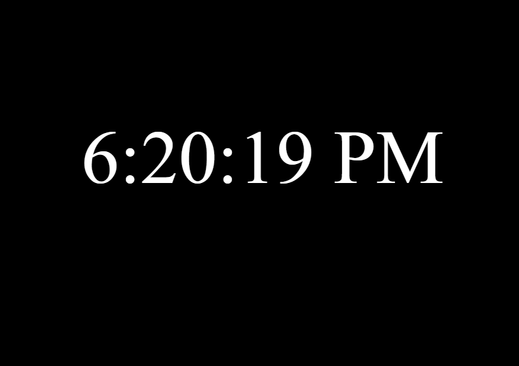

# digi_clock
# 🕒 Digital Clock - JavaScript Project

A simple and elegant digital clock built using basic **HTML**, **CSS (inline)**, and **JavaScript**. This clock displays the current local time and updates every second.

##  Features

-  Real-time digital clock
-  Updates every second using `setInterval`
-  Minimalist styling using inline CSS
-  Fully responsive and centered on screen

##  Files

| File       | Description                          |
|------------|--------------------------------------|
| `pro_1.html` | Basic HTML layout for the clock     |
| `pro_1.js`    | JavaScript logic for live updating time |
| `README.md`  | Project overview and documentation |

##  How to Run Locally

1. Clone or download this repository.
2. Open `pro_1.html` in any modern web browser.
3. The clock will start ticking immediately!

##  Screenshot

##  Future Enhancements

- Add AM/PM format toggle
- Add dark/light mode switch
- Add user timezone dropdown
- Add day/date below the time
- Make it more enhanced using great UI design
- Adding more advanced features like alarm, countdown and a special time of study focused conversion

##  License

This project is open source and free to use under the MIT License.
